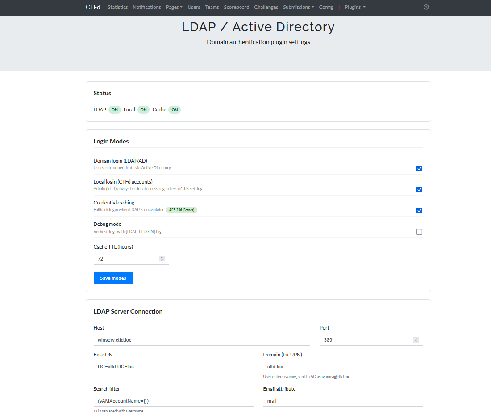
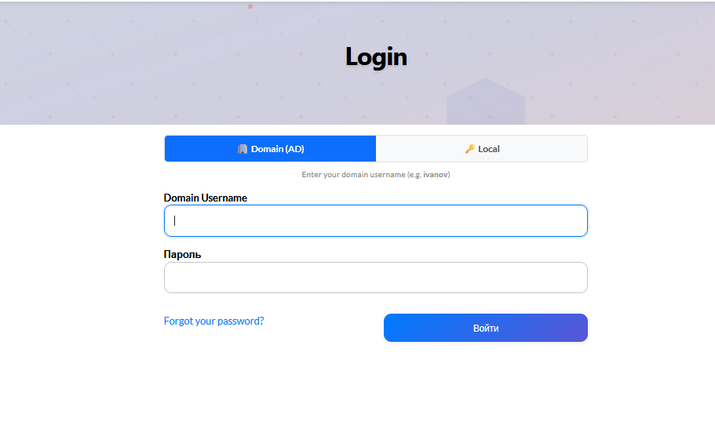

# CTFd LDAP / Active Directory Plugin

[🇬🇧 English version](README.md)

Аутентификация через Active Directory для CTFd. Позволяет участникам входить через доменные учётные данные, сохраняя стандартный локальный вход как резервный вариант.

Альтернатив для CTFd не существует — этот плагин закрывает пробел который официальный проект никогда не затрагивал.

## Скриншоты

### Настройки в админке


### Страница входа


## Возможности

| Функция | Описание |
|---|---|
| Доменный вход | Аутентификация через AD используя UPN (`user@domain`) |
| Локальный вход | Стандартные аккаунты CTFd работают параллельно |
| Переключатель входа | Вкладки Domain / Local на странице логина |
| Авторегистрация | Новые AD пользователи получают аккаунт CTFd при первом входе |
| Синхронизация имени | Имя пользователя CTFd берётся из AD `displayName` / `cn` |
| Обход для суперадмина | User ID=1 всегда может войти локально, даже если локальный вход отключён |
| Кэш учётных данных AES-256 | Офлайн-вход когда AD недоступен (Fernet) |
| TTL кэша | Настраиваемый (по умолчанию 72 ч) |
| Кастомный DNS | Резолвинг внутренних AD-хостов через указанный DNS сервер |
| Автоназначение команд | Маппинг AD-групп → команды CTFd автоматически |
| Фильтрация категорий | Показ только разрешённых категорий заданий для команды |
| Админ-панель | `/admin/ldap-settings` — настройка всего через UI |
| TCP ping | Проверка доступности LDAP сервера |
| Bind test | Проверка учётных данных и предпросмотр email + displayName |
| Debug режим | Подробное логирование с тегом `[LDAP-PLUGIN]` |

## Требования

- CTFd 3.7.x
- Python 3.8+
- `ldap3 >= 2.9`
- `cryptography >= 41.0` (опционально, но требуется для AES-256 кэша)
- `dnspython` (опционально, требуется для кастомного DNS резолвинга)

## Установка

```bash
# 1. Скопируй папку плагина в CTFd
cp -r ldap_plugin /opt/ctfd/CTFd/plugins/

# 2. Установи зависимости
pip install ldap3>=2.9 cryptography>=41.0

# Опционально: поддержка кастомного DNS
pip install dnspython

# 3. Перезапусти CTFd
docker restart ctfd
# или
systemctl restart ctfd
```

## Docker

Если запускаешь CTFd в Docker, добавь это в свой Dockerfile:

```dockerfile
FROM ctfd/ctfd:latest
USER root
RUN pip install "ldap3>=2.9" "cryptography>=41.0"
USER ctfd
```

> Замени `latest` на конкретную версию если нужно (например `ctfd/ctfd:3.8.5`)

Без этих зависимостей плагин молча не загрузится.

## Настройка

Открой **Admin → LDAP Settings** (`/admin/ldap-settings`) и заполни данные своего AD.

| Настройка | По умолчанию | Описание |
|---|---|---|
| `ldap_enabled` | `true` | Включить доменный вход |
| `ldap_host` | `winserv.ctfd.loc` | Хостнейм или IP LDAP сервера |
| `ldap_port` | `389` | Порт (`636` для LDAPS) |
| `ldap_use_ssl` | `false` | Использовать LDAPS |
| `ldap_use_tls` | `false` | Использовать STARTTLS |
| `ldap_base_dn` | `DC=ctfd,DC=loc` | Base DN для поиска пользователей |
| `ldap_domain` | `ctfd.loc` | Суффикс домена для UPN |
| `ldap_search_filter` | `(sAMAccountName={})` | Фильтр поиска LDAP |
| `ldap_attr_email` | `mail` | Атрибут AD для email |
| `ldap_local_enabled` | `true` | Разрешить локальный вход CTFd |
| `ldap_debug` | `false` | Включить подробное логирование |
| `ldap_cache_enabled` | `true` | Кэшировать учётные данные для офлайн-входа |
| `ldap_cache_ttl` | `72` | TTL кэша в часах |
| `ldap_dns_server` | `192.168.1.1` | Кастомный DNS для резолвинга AD-хостов |

## Автоназначение команд

Если CTFd работает в **режиме Teams**, плагин может автоматически назначать пользователей в команды на основе их членства в AD-группах.

1. Перейди в **Admin → LDAP Settings → Teams**
2. Привяжи AD group CN → имя команды CTFd (например `ctf-web` → `Web Team`)
3. Включи фильтрацию категорий если хочешь чтобы каждая команда видела только свои задания

### Логика фильтрации категорий

1. Если у задания есть тег `team:X` → показывается только команде X (переопределяет правило категории)
2. Если тегов `team:*` нет → показывается на основе разрешённого списка категорий для команды
3. Если фильтрация выключена или команда не в маппинге → все задания видны

## Логи отладки

```bash
# Docker
docker logs <container> 2>&1 | grep "LDAP-PLUGIN"

# systemd
journalctl -u ctfd | grep "LDAP-PLUGIN"
```

## FAQ

**Как войти если LDAP ещё не настроен?**
Используй вкладку **Local** на странице логина с админскими учётными данными которые ты задал при настройке CTFd. User ID=1 всегда имеет локальный доступ.

**Пользователь получает 403 при первом входе?**
CTFd 3.7 иногда может блокировать вход если плагин перехватывает auth route до того как сессия полностью инициализирована. Используй вкладку **Local** как обходной путь.

**Email не найден в AD?**
Некоторые настройки AD хранят email в `userPrincipalName` или `proxyAddresses` вместо `mail`. Поменяй `ldap_attr_email` в панели настроек.

**Хостнейм LDAP сервера не резолвится?**
Укажи `ldap_dns_server` как IP твоего внутреннего DNS. Установи `dnspython` чтобы включить кастомный DNS резолвинг.

## Совместимость

- CTFd 3.7.x
- Работает вместе с [ctfd-user-control-plugin](https://github.com/defojeco/ctfd-user-control-plugin)

## Лицензия

MIT
